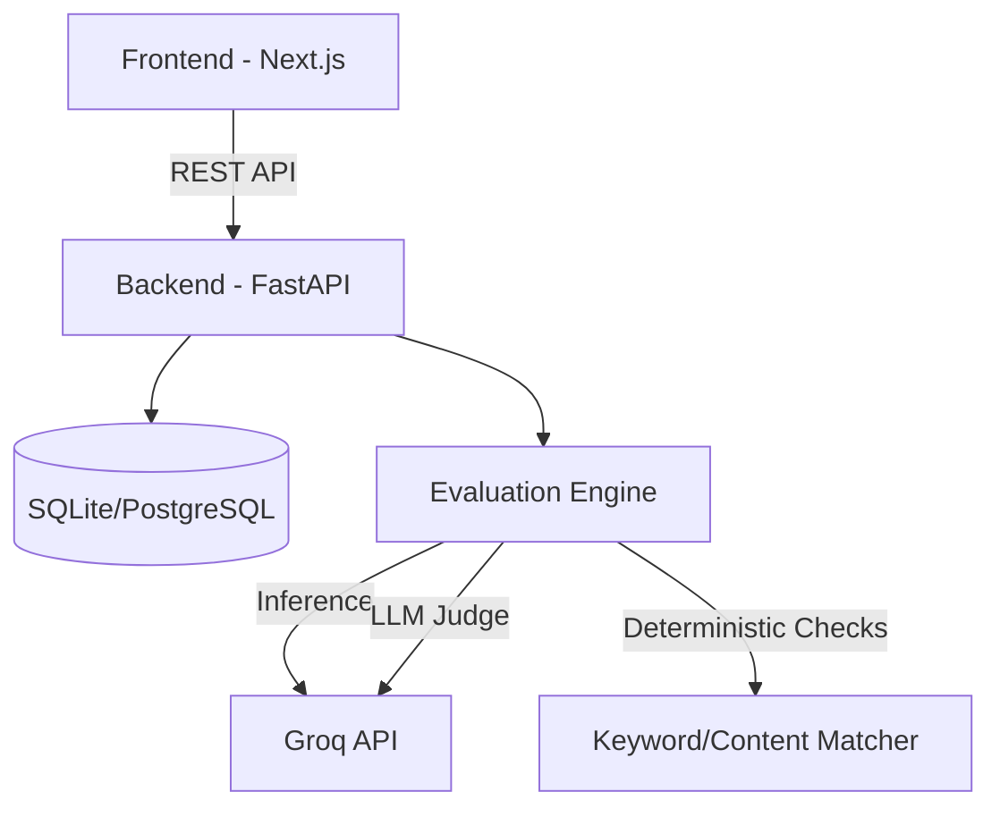

# prmptlab
**Test. Break. Improve.**

**prmptlab** is an LLM system-prompt evaluation and red-teaming platform. It allows developers to create system prompts, define reusable test cases, run them against LLMs (via Groq), and evaluate responses using deterministic checks and an LLM judge.

## Architecture


## Features
- **Prompt Versioning**: Immutable system prompt versions.
- **Test Suites**: Reusable deterministic and qualitative test cases.
- **LLM-as-a-Judge**: Evaluates instruction following, safety, intent, and tone.
- **Red Team Generator**: Automatically generate adversarial inputs based on your system prompt.
- **Entitlements & Quotas**: Built-in plan entitlement management (Free, Plus, Pro, Enterprise).
- **Billing Integration**: Dodo Payments checkout session integration.

## Setup

### Environment Variables
Create a `.env` file in the `backend/` directory:
```
GROQ_API_KEY=your_groq_api_key_here
DATABASE_URL=sqlite+aiosqlite:///./promptbench.db
```

### Backend
```bash
cd backend
python -m venv .venv
source .venv/bin/activate
pip install -r requirements.txt
python -m app.seed  # Seeds demo data
uvicorn app.main:app --reload
```
API runs on `http://localhost:8000`. API docs available at `http://localhost:8000/docs`.

### Frontend
```bash
cd frontend
npm install
npm run dev
```
UI runs on `http://localhost:3000`.
